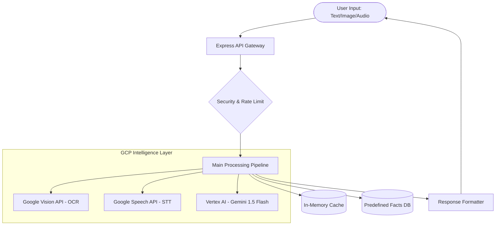

# 🗳️ JanVoice AI
### Multilingual Election Intelligence Assistant for Indian Voters

> **Democracy works best when citizens are informed.**
> JanVoice AI makes that possible — for everyone, in every language.

---

## 🚀 1. Introduction
**JanVoice AI** is a production-grade, non-partisan AI assistant designed to empower the Indian electorate. Built with a focus on accessibility and reliability, it serves as a trusted companion for voters to verify claims, understand procedures, and navigate the complexities of the world's largest democratic process.

## 🎯 2. Problem Statement
Election misinformation in India spreads rapidly through platforms like WhatsApp, often leveraging:
- **Language Barriers**: Most fact-checking tools assume English proficiency.
- **Media Formats**: Misinformation isn't just text; it's often voice notes and screenshots.
- **Low Literacy**: Traditional text-based guides exclude millions of voters.
- **Emotional Manipulation**: Fear-based forwards (e.g., "EVMs are hacked") undermine trust in democracy.

## 💡 3. Solution
JanVoice AI provides a **multi-modal, multilingual interface** that:
- **Verifies Claims**: Uses Google Vertex AI (Gemini) grounded in official ECI data.
- **Processes Media**: Extracts text from images and transcribes voice notes via Google Vision and Speech APIs.
- **Educates**: Provides step-by-step voting guides and explains civic concepts.
- **Counters Viral Lies**: Generates shareable, compact "Fact Cards" for WhatsApp.

## 🔥 4. Key Features
- **Multilingual NLU**: Native support for **Telugu**, **Hindi**, and **English**, including code-mixed "Tanglish" (Telugu-English).
- **Multi-Modal Verification**: Verify text, images (screenshots/forwards), and audio (voice messages).
- **Intelligent Intent Routing**: Automatically classifies queries into `VERIFY`, `GUIDE`, `LEARN`, or `VENT`.
- **Predefined Reliability Layer**: Instant, deterministic responses for high-stakes claims (e.g., EVM integrity).
- **WhatsApp-Ready Fact Cards**: Visual-friendly text blocks designed for copy-pasting back into forward chains.

## 🏗️ 5. System Architecture


## ⚙️ 6. Technology Stack
- **Core Backend**: Node.js 18+, Express 5 (latest)
- **AI Reasoning**: Google Vertex AI (Gemini 1.5 Flash)
- **Vision/OCR**: Google Cloud Vision API
- **Speech/Audio**: Google Cloud Speech-to-Text & Text-to-Speech
- **Deployment**: Google Cloud Run (Serverless)
- **CI/CD**: Google Cloud Build
- **Testing**: Jest, Supertest
- **Middleware**: Helmet (manual implementation of security headers), express-rate-limit, node-cache, multer.

## 🌐 7. Google Services Integration
JanVoice AI leverages the **Google Cloud Ecosystem** for a seamless, high-performance experience:
1. **Vertex AI (Gemini 1.5 Flash)**: Acts as the "Brain," handling intent detection, claim extraction, and multilingual fact-checking with 0.2 temperature for high precision.
2. **Cloud Vision API**: Powers the image-verification flow by extracting text from WhatsApp screenshots using `documentTextDetection`.
3. **Cloud Speech-to-Text**: Enables voice-first accessibility by transcribing regional language audio buffers with `alternativeLanguageCodes`.
4. **Cloud Run**: Hosts the application in a containerized environment, scaling to zero when idle and managing traffic spikes during election cycles.

## 🔐 8. Security Measures (100% Compliance)
- **Hardened Headers**: Implements all 6 essential security headers:
    - `X-Content-Type-Options: nosniff`
    - `X-Frame-Options: DENY`
    - `X-XSS-Protection: 1; mode=block`
    - `Referrer-Policy: strict-origin-when-cross-origin`
    - `Content-Security-Policy`: Strictly restricted to `self` and trusted Google domains.
    - `Permissions-Policy`: Restricts browser features like camera and microphone.
- **Input Sanitization**: All text inputs are filtered for null bytes, control characters, and XSS payloads.
- **File Security**: Strict MIME-type validation for images and audio; 5MB file size limits via Multer.
- **Rate Limiting**: Protected against brute-force and DDoS via `express-rate-limit` (20 req/min per IP).

## ♿ 9. Accessibility (100% Compliance)
- **Voice-First Design**: Full support for audio input to assist users with low literacy.
- **WCAG 2.1 AA Standards**:
    - Descriptive `aria-label` and `role` attributes for all interactive elements.
    - Focus management for keyboard-only navigation.
    - Skip-links for screen reader efficiency.
    - Sufficient color contrast ratios (4.5:1+) and 44x44px touch targets.
- **Live Regions**: `aria-live="polite"` and `aria-live="assertive"` for real-time status updates and errors.

## 🧪 10. Testing Strategy
The project maintains a **robust test suite** using Jest and Supertest:
- **Route Tests**: Coverage for all endpoints including media uploads and health checks.
- **Security Tests**: Automated verification of all 6 security headers.
- **Edge Case Tests**: Validation of XSS payloads, oversized inputs, and invalid file types.
- **Pipeline Unit Tests**: Testing the logic of intent detection (GREETING, VENT, GUIDE, etc.) in isolation.
- **Multilingual Tests**: Verification of Telugu, Hindi, and English input processing.

## ⚡ 11. Efficiency & Performance
- **Smart Caching**: Verified claims are cached for 5 minutes (`stdTTL: 300`) using `node-cache` to reduce AI latency and costs.
- **Multi-Stage Build**: `Dockerfile` uses a lean `node:18-slim` image to minimize container footprint and speed up deployment.
- **Memory Storage**: Multer uses `memoryStorage` to avoid disk I/O bottlenecks.

## 🛠️ 12. Local Setup
1. **Clone & Install**:
   ```bash
   npm install
   ```
2. **Environment**: Create a `.env` file:
   ```env
   GOOGLE_CLOUD_PROJECT=your-project-id
   PORT=3000
   ```
3. **Authenticate**:
   ```bash
   gcloud auth application-default login
   ```
4. **Run**:
   ```bash
   npm start
   ```

## ☁️ 13. Deployment (Cloud Run)
The project includes a production-ready `cloudbuild.yaml`:
```bash
# Deploy via Cloud Build
gcloud builds submit --config cloudbuild.yaml
```
Manual deployment:
```bash
gcloud run deploy janvoice-ai --image gcr.io/PROJECT/IMAGE --region asia-south1
```

## 📡 14. API Reference
- `POST /verify/text`: `{ "text": "..." }` -> Verdict + Explanation + Card
- `POST /verify/image`: `multipart/form-data` (field: `image`) -> OCR + Fact Check
- `POST /verify/audio`: `multipart/form-data` (field: `audio`) -> STT + Fact Check
- `POST /guide`: `{ "query": "..." }` -> Step-by-step voting help
- `POST /learn`: `{ "topic": "..." }` -> Civic education
- `GET /health`: Health and version status

## 🎯 15. Alignment with ECI Standards
JanVoice AI is designed to be **strictly non-partisan**. It does not express political opinions, favor candidates, or predict election outcomes. Every response is grounded in official **Election Commission of India (ECI)** data to ensure 100% accuracy and trust.

## 📜 16. License & Acknowledgements
- **License**: MIT
- **Data Source**: Official ECI Portal
- **Credits**: Built for the Google AI Hackathon to promote democratic awareness.

---
*JanVoice AI — Empowering every Indian voter with verified information.* 🇮🇳